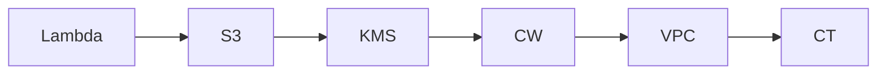

# InfraTales | AWS CDK Security Baseline: Enforce KMS, IAM, and CloudTrail by Data Tier

**AWS CDK (TYPESCRIPT) reference architecture — security pillar | advanced level**

> Your security team hands you a 40-page compliance checklist — encryption at rest, least-privilege IAM, audit trails, network isolation — and expects it enforced consistently across every environment, not just documented in a wiki that nobody reads. Manual console clicks drift within weeks, and the next audit finds your S3 buckets using AWS-managed keys instead of customer-managed KMS with rotation, or CloudTrail logging quietly disabled on a non-prod account that shares a VPC with prod. This repo addresses the core problem: turning security controls from aspirational policy into version-controlled, peer-reviewable, deployable CDK code.

[](LICENSE)
[](CONTRIBUTING.md)
[](https://aws.amazon.com/)
[-IaC-purple.svg)](https://aws.amazon.com/cdk/)
[](https://infratales.com/p/0f297b74-ddea-423e-bbe3-01e948a40762/)
[](https://infratales.com)


## 📋 Table of Contents

- [Overview](#-overview)
- [Architecture](#-architecture)
- [Key Design Decisions](#-key-design-decisions)
- [Getting Started](#-getting-started)
- [Deployment](#-deployment)
- [Docs](#-docs)
- [Full Guide](#-full-guide-on-infratales)
- [License](#-license)

---

## 🎯 Overview

The stack provisions a layered security baseline using AWS CDK (TypeScript): KMS with three purpose-scoped customer-managed keys (data encryption, log encryption, database encryption) wired to S3 buckets and EBS volumes; IAM roles and policies enforcing least-privilege access boundaries; a VPC with network segmentation for compute (EC2/Lambda); CloudTrail for API-level audit logging writing to the KMS-encrypted S3 log bucket; and CloudWatch for operational monitoring and alerting. The non-obvious design choice is the separation of KMS keys by data classification tier rather than a single shared key — this lets you rotate, disable, or audit access per data type independently, which matters when a security incident touches only one tier. CloudTrail and CloudWatch are deliberately wired to different KMS keys from the application data keys, so a compromise of the data key cannot silently suppress audit evidence.

**Pillar:** SECURITY — part of the [InfraTales AWS Reference Architecture series](https://infratales.com).
**Target audience:** advanced cloud and DevOps engineers building production AWS infrastructure.

---

## 🏗️ Architecture



> 📐 See [`diagrams/`](diagrams/) for full architecture, sequence, and data flow diagrams.

> Architecture diagrams in [`diagrams/`](diagrams/) show the full service topology (architecture, sequence, and data flow).
> The [`docs/architecture.md`](docs/architecture.md) file covers component responsibilities and data flow.

---

## 🔑 Key Design Decisions

- Three separate KMS customer-managed keys cost ~$3/month each (~$36/year base) plus per-API-call charges — negligible at low scale, but at high S3 PUT/GET throughput the KMS API call costs can exceed the key fee itself; a shared key would be cheaper but collapses the audit isolation boundary [inferred]
- CDK-managed IAM roles scoped to the 12 actions this construct actually needs are harder to onboard new developers to than AWS managed policies — but aws:iam::aws:policy/AdministratorAccess grants 400+ actions and managed policies accumulate scope over time as teams add permissions to unblock incidents without removing them after; that accumulation is what fails audit reviews [inferred]
- CloudTrail data events on S3 (object-level logging) add cost proportional to request volume — enabling them on all buckets in a high-throughput pipeline can cost hundreds of dollars per month, so selective enabling per sensitive bucket is the right default [inferred]
- Encrypting CloudWatch Logs with a customer-managed KMS key requires the key policy to explicitly grant the logs.amazonaws.com service principal access — miss this and your log group silently fails to write, which is a production incident waiting to happen [from-code]
- VPC-isolated Lambda or EC2 compute adds ENI attachment latency and requires NAT Gateway or VPC endpoints for AWS API calls; skipping VPC endpoints and using NAT Gateway routes all KMS/S3 traffic through NAT, adding both cost and a single egress choke point [inferred]

> For the full reasoning behind each decision — cost models, alternatives considered, and what breaks at scale — see the **[Full Guide on InfraTales](https://infratales.com/p/0f297b74-ddea-423e-bbe3-01e948a40762/)**.

---

## 🚀 Getting Started

### Prerequisites

```bash
node >= 18
npm >= 9
aws-cdk >= 2.x
AWS CLI configured with appropriate permissions
```

### Install

```bash
git clone https://github.com/InfraTales/<repo-name>.git
cd <repo-name>
npm install
```

### Bootstrap (first time per account/region)

```bash
cdk bootstrap aws://YOUR_ACCOUNT_ID/YOUR_REGION
```

---

## 📦 Deployment

```bash
# Review what will be created
cdk diff --context env=dev

# Deploy to dev
cdk deploy --context env=dev

# Deploy to production (requires broadening approval)
cdk deploy --context env=prod --require-approval broadening
```

> ⚠️ Always run `cdk diff` before deploying to production. Review all IAM and security group changes.

---

## 📂 Docs

| Document | Description |
|---|---|
| [Architecture](docs/architecture.md) | System design, component responsibilities, data flow |
| [Runbook](docs/runbook.md) | Operational runbook for on-call engineers |
| [Cost Model](docs/cost.md) | Cost breakdown by component and environment (₹) |
| [Security](docs/security.md) | Security controls, IAM boundaries, compliance notes |
| [Troubleshooting](docs/troubleshooting.md) | Common issues and fixes |

---

## 📖 Full Guide on InfraTales

This repo contains **sanitized reference code**. The full production guide covers:

- Complete AWS CDK (TYPESCRIPT) stack walkthrough with annotated code
- Step-by-step deployment sequence with validation checkpoints
- Edge cases and failure modes — what breaks in production and why
- Cost breakdown by component and environment
- Alternatives considered and the exact reasons they were ruled out
- Post-deploy validation checklist

**→ [Read the Full Production Guide on InfraTales](https://infratales.com/p/0f297b74-ddea-423e-bbe3-01e948a40762/)**

---

## 🤝 Contributing

See [CONTRIBUTING.md](CONTRIBUTING.md) for guidelines. Issues and PRs welcome.

## 🔒 Security

See [SECURITY.md](SECURITY.md) for our security policy and how to report vulnerabilities responsibly.

## 📄 License

See [LICENSE](LICENSE) for terms. Source code is provided for reference and learning.

---

<p align="center">
  Built by <a href="https://infratales.com">InfraTales</a> — Production AWS Architecture for Engineers Who Build Real Systems
</p>
